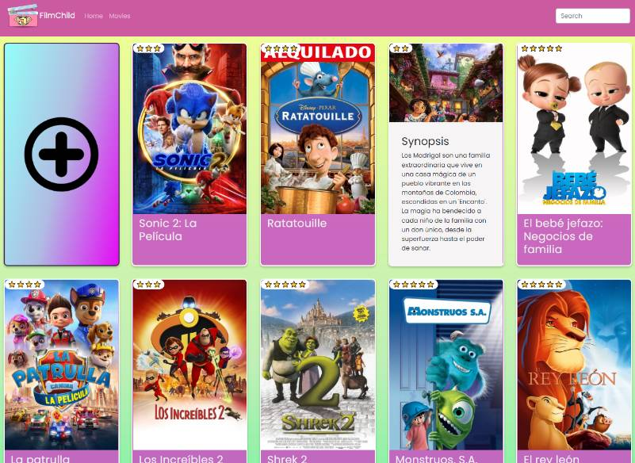
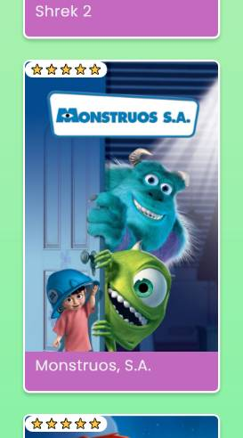
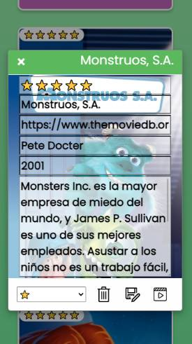

 # Project Filmcity (Front-end) 🎥 🎬 🍿

Our Filmcity Front-end project is our best effort to offer an scalable product for the client to request, send, edit, delete, rate, etc... a set of movies.

**Link to the project:** https://github.com/checkmyprojects/filmcity-frontend
**Link to our backend:** https://github.com/Dfcc/filmcity

 
  

## How It's Made:

**Tech used:** HTML5, CSS3, JavaScript, Bootstrap.

We made it to work with our FilmCity backend made with Java and Spring.

 ## How to install it

We pursued the ambition to make it easy & quick to use, therefore you only need the following Git command to install all the requirements you need to run it:

``git clone https://github.com/checkmyprojects/filmcity-frontend.git``

To avoid CORS errors, our backend allows connections from http://127.0.0.1:5500
To use a different IP or port, it needs to be allowed on the backend using:

``@CrossOrigin(origins="http://127.0.0.1:5500/")``

 ## What this front-end API offers

We defined a set of functionalities that we and our client considered mandatory to achieve our common goals:

 1. The ability to dinamically display the list of movies
 2. Being capable of adding, deleting & editing any movie at any time
 3. A rating system
 4. A renting movie system
 5. A seach bar to find the movie you always have been looking for
